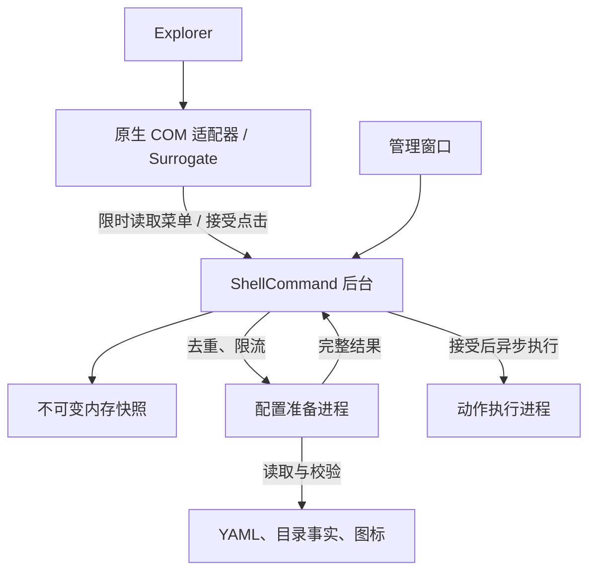

# ShellCommand 整体重设计

设计草案 · 2026-09-11 · 配置格式 v2 · 已按安装布局与无兼容要求修订

**目标：精简且不附带 .NET 运行时的交付，一个清楚的管理窗口，一套容易写的 YAML；右键菜单的速度与稳定性不依赖配置文件、磁盘或用户命令是否正常。**

本稿基于实际读取的默认分支 `win11dev`，基线提交 [`753a144717d22bd4603921d942a0faf78225a146`](https://github.com/XUJINKAI/ShellCommand/tree/753a144717d22bd4603921d942a0faf78225a146)。本文是下一轮设计提案，不表示下列功能已经实现，也不直接覆盖仓库现有契约。此次不修改代码、不注册系统组件。

## 1. 产品方向与关键决定

借鉴 force-break 的是使用方式：双击打开、状态清楚、按钮直接、常见操作在一个窗口完成，内部实现不要求用户理解。

保留 ShellCommand 的核心价值：根据当前目录或选中对象，在 Windows 右键菜单中提供自定义命令；YAML 是配置入口；保留查看和可逆管理其他右键菜单的能力。

| 项目 | 新设计决定 |
| --- | --- |
| 下载物 | 托管入口采用不含运行时的单文件发布参数；成品尽量精简，允许单 EXE 释放多文件，也允许少量文件组成的 ZIP |
| 技术栈 | .NET 10 + WPF 管理窗口；原生 C++ Shell 适配器 |
| 运行时依赖 | 同架构的 .NET 10 Desktop Runtime；可以与 force-break 共用机器上已有的安装 |
| 安装根目录 | 固定 `%LOCALAPPDATA%\ShellCommand11`；程序位于 `runner/`，全局配置位于 `config/` |
| 用户配置 | `config/global.shellcommand.yaml`；项目目录继续使用 `.shellcommand.yaml`，不把项目配置复制到安装目录 |
| 用户窗口 | 菜单、系统菜单、设置三个页面；首页直接编辑和预览自己的菜单 |
| 后台 | 每个用户会话一个普通权限实例；优先共用入口的后台模式，必要时允许独立辅助 EXE；无 Windows Service |
| Explorer 路径 | 原生适配器 + 明确的进程隔离；不解析 YAML、不扫描磁盘、不启动用户命令 |
| 菜单请求 | 只读已经准备好的内存快照；冷目录先显示可用项，准备完成后下次打开显示完整项 |
| 命令启动 | 接受请求和执行动作分离；菜单不等待 UAC、进程启动或命令结束 |
| 配置格式 | 仅支持 YAML v2；不实现旧配置解析、导入、迁移、自动升级或旧协议兼容层 |
| 优先级 | Explorer 稳定 → 菜单可用 → 配置易用 → 选中对象/子菜单 → 管理器完整度 |

不继续把“未来可复用 Core”的工程实验作为产品目标。Core 保持干净即可，不为潜在的 OneQuick、插件市场、工作流引擎提前抽象。

## 2. 现状：哪些是代码证据，哪些尚未证实

目前已经不是原来的 SharpShell 版本，而是 C++、Broker、WPF 的 Win11 重写版。方向有基础，但多个重要约束只存在于文档中，执行链没有落实。

**没有取得用户机器的转储或性能轨迹，因此不能断言已经定位到那一次 Explorer 卡死的唯一原因。**下面区分可直接确认的缺陷与需要实机验证的故障路径。

| 发现 | 代码依据 | 影响与结论 |
| --- | --- | --- |
| 超时取消后异步 I/O 状态提前失效 | `ShellCommandExplorer.cpp / TimedIo`：`OVERLAPPED` 在栈上；超时后 `CancelIoEx`，关闭事件并直接返回 | 取消并不表示完成；原状态及读写缓冲可能在完成前失效。是需要首先修正的原生生命周期缺陷，可能造成崩溃或异常行为 |
| 30ms 不是整个回调的硬上界 | `ResolveCore` 在打开 pipe、编码后才创建 deadline；响应解析未按剩余预算中止；同步完成的 I/O 路径不重新检查 deadline | 当前代码不能支撑文档中的“全部工作硬截止 30ms”承诺 |
| 解析与目录 I/O 仍在菜单请求上 | `BrokerEngine.Resolve → FileConfigRuntime.Load → File.ReadAllText`；`FileSystemDirectoryFacts.Exists` 首次直接枚举全部子项 | 大目录、网络盘、占位文件或异常存储会拖慢 Broker；仅把工作移到另一个进程还不够 |
| Invoke 响应在启动动作之后返回 | `DispatchAsync → InvokeAsync → ExecuteAsync → Process.Start` 后才构造回复 | UAC、ShellExecute 或启动程序的延迟会污染菜单点击路径；客户端超时却可能已执行，状态不清楚 |
| 后台入口缺少实际单实例和请求上限 | Broker `Program` 没有单实例互斥；pipe 请求没有独立请求截止和明确并发配额 | 多次启动、半包客户端或慢任务可积累资源；每用户会话一个实例仍是文档目标 |
| token 过期没有主动清理/容量上限 | `ActionTokenStore.Issue` 持续插入；仅 `TryConsume` 时检查过期并移除 | 反复打开但不点击菜单，token 字典持续增长 |
| 变量 helper 没接入真实执行链 | `VariableExpander.Expand` 在源码执行路径中未被调用；菜单把原始 `Command` 放进 `ActionSpec` | helper 的单元测试通过不代表 `%DIR%` 实际能用 |
| 用户配置的分隔线被提前跳过 | `MenuResolver.ResolveCommands` 遇到 `IsSeparator` 直接 `continue` | 后面的 Normalize 不能恢复已经丢失的分隔线 |
| 内置开关被后台固定能力值覆盖 | `Program` 固定 `BuiltInCapabilities(true, true)` | `Functions.CopyPath/EditGlobal` 无法按预期完整控制实际菜单 |
| 背景目录上下文依赖脆弱的调用顺序 | `GetState` 只从 `IShellItemArray` 第一个项取路径；快速调用还会清空缓存；没有 site 上下文实现 | 空白处右键未必提供这个 selection，可能只有 fallback；需要 Windows 实际回调验证，不能猜目录 |
| YAML 限制施加太晚 | 先 `YamlStream.Load` 建图，再递归 `ValidateTree`；超深时只添加错误，仍继续递归 | 不能靠事后深度检查抵御深层/引用结构；需要解析事件阶段限制和回归测试 |
| 界面与既有文档不一致 | `MainWindow.xaml` 主要是安装状态；缺少正式的配置编辑、预览和菜单管理页 | 当前界面没有实现文档描述的完整日常工作流 |
| 交付仍包含运行时且有多个文件 | `Package.cmd` 分别对 App、Broker 使用 `--self-contained true`，再打 ZIP | 需要调整发布方式、入口和资源管理，不能只改压缩包扩展名 |

主要源码链接：[原生适配器](https://github.com/XUJINKAI/ShellCommand/blob/753a144717d22bd4603921d942a0faf78225a146/src/ShellCommand.Explorer/ShellCommandExplorer.cpp)、[Runtime](https://github.com/XUJINKAI/ShellCommand/blob/753a144717d22bd4603921d942a0faf78225a146/src/ShellCommand.Broker/Runtime.cs)、[Engine](https://github.com/XUJINKAI/ShellCommand/blob/753a144717d22bd4603921d942a0faf78225a146/src/ShellCommand.Broker/Engine.cs)、[Pipe](https://github.com/XUJINKAI/ShellCommand/blob/753a144717d22bd4603921d942a0faf78225a146/src/ShellCommand.Broker/PipeProtocol.cs)、[token](https://github.com/XUJINKAI/ShellCommand/blob/753a144717d22bd4603921d942a0faf78225a146/src/ShellCommand.Broker/Tokens.cs)、[Resolver](https://github.com/XUJINKAI/ShellCommand/blob/753a144717d22bd4603921d942a0faf78225a146/src/ShellCommand.Core/MenuResolver.cs)、[YAML](https://github.com/XUJINKAI/ShellCommand/blob/753a144717d22bd4603921d942a0faf78225a146/src/ShellCommand.Config.Yaml/ConfigParser.cs)、[打包](https://github.com/XUJINKAI/ShellCommand/blob/753a144717d22bd4603921d942a0faf78225a146/packaging/scripts/Package.cmd)。

微软明确要求：取消的 I/O 完成前不能释放或复用对应的 `OVERLAPPED`；`CancelIoEx` 本身不会等待完成。[CancelIoEx 文档](https://learn.microsoft.com/en-us/windows/win32/api/ioapiset/nf-ioapiset-cancelioex)

## 3. 编译与交付：无运行时优先，文件数量服从工程需要

### 3.1 编译要求与最终包装分开

托管入口使用 `PublishSingleFile=true`、`SelfContained=false`，即 framework-dependent 单文件发布；不附带 .NET Desktop Runtime。若最终拆出独立 Broker/辅助 EXE，各托管入口采用同样的发布原则。原生 C++ DLL、身份注册资源和必要图标可以独立存在，不为了物理上只剩一个文件增加复杂度。

.NET 支持 framework-dependent 单文件发布；自身 EXE 路径使用 `Environment.ProcessPath`，程序旁边的资源使用 `AppContext.BaseDirectory`，不能依赖单文件中可能为空的 `Assembly.Location`。[.NET 单文件发布](https://learn.microsoft.com/en-us/dotnet/core/deploying/single-file/overview)

**首版优先选择少量文件的 ZIP，用户解压后运行 `ShellCommand.exe` 完成安装。**典型内容是托管入口、原生扩展 DLL，以及一个集成资源目录。发布流程已经简单可靠后，可以把这些资源嵌入同一个 EXE，在安装时释放；两种包装共用安装逻辑，不另建两套产品，也不要求首版同时提供两种下载。

单文件只是托管发布选项与成品精简目标，不是架构不变量。不采用把 native DLL 塞进内存加载器、临时目录 COM 注册等方式凑文件数，也不要求多个独立 EXE 的全部依赖重新散落发布。

原生 DLL 的 MSVC CRT 优先静态链接，避免再要求用户安装一个单独的 VC++ Redistributable；这是 native 组件的链接选择，不等于把 .NET 运行时重新打包进去。最终由干净系统验收确认依赖。

### 3.2 固定安装布局

安装根固定为 `%LOCALAPPDATA%\ShellCommand11`，即用户的 `AppData\Local\ShellCommand11`。通过系统的 LocalApplicationData 目录定位，不硬编码用户名。下载目录和 ZIP 解压目录只是安装来源，安装后不能再依赖它们。

下表路径均相对于该安装根，项目配置除外：

| 路径 | 内容 | 生命周期 |
| --- | --- | --- |
| `runner/<build-id>/ShellCommand.exe` | 当前版本管理入口，可兼任后台、准备和执行模式 | 程序管理 |
| `runner/<build-id>/ShellCommand.Explorer.dll` | 本版本原生 COM 适配器 | 程序管理 |
| `runner/<build-id>/integration/` | 身份注册资源及必要图标 | 程序管理 |
| `runner/<build-id>/` 中必要的辅助 EXE | 仅在拆分有实际收益时增加，不强求全部合为一个入口 | 程序管理 |
| `config/global.shellcommand.yaml` | 全局菜单配置 | 用户编辑、备份；安装/更新保留 |
| `config/menus/` | 可选的 include 配置片段 | 用户管理 |
| `config/icons/`、`config/scripts/` | 可选的自定义图标和脚本 | 用户管理，不随 runner 替换 |
| `state/` | 当前 build、安装事务、应用设置、菜单修改记录 | 程序管理 |
| `cache/` | 有效配置快照、准备好的图标等可重建数据 | 程序管理 |
| `logs/` | 本地诊断与执行结果 | 设置页可查看，限制体积 |
| `temp/` | 安装暂存和辅助任务临时文件 | 完成后清理 |
| 项目目录 `.shellcommand.yaml` | 该目录菜单 | 保留在项目内，不搬入安装根 |

`runner/<build-id>/` 是 runner 的版本化子目录：避免正在使用的原生 DLL 被原地覆盖，也使一套托管/native 文件保持一致。`state` 记录当前版本，快捷方式、自启动、COM 注册和辅助进程启动均指向该版本的实际绝对路径。若实现期证明无需并存，可简化版本目录管理，但 `config/` 与 `runner/` 的分离不能取消。

首次安装只在全局配置不存在时创建 v2 模板；遇到已有但无效的配置不覆盖。安装完成后从 runner 启动，删除下载文件或解压目录不影响日常使用。之后运行另一份发布物，应识别固定安装根并更新该安装，不创建第二套菜单。

不使用 .NET 临时解压目录注册 COM。旧 DLL 正在使用时保留对应 runner 版本，待释放后清理。配置、日志和持久状态都不写回发布物目录或 runner。

### 3.3 进程边界不等于发布文件数量

| 角色 | 责任 | 生命周期 |
| --- | --- | --- |
| 管理入口 | 管理窗口；重复打开激活已有窗口 | 用户打开期间 |
| 后台 | IPC、内存快照、刷新调度、动作队列 | 当前用户会话常驻 |
| 配置准备 | 读取配置/目录、解析 YAML、准备图标 | 有界的短期辅助进程 |
| 动作执行 | 启动程序、脚本、UAC、复制/打开动作 | 单次任务或任务窗口期间 |
| 安装/卸载 CLI | 紧急恢复、自动化 | 单次操作 |

优先让一个托管入口按参数承载这些角色，减少构建与部署重复；若独立辅助 EXE 更清晰或有利于故障隔离，可以拆分并放入同一 runner 版本目录。进程边界必须保留，不因共用 EXE 就把准备/执行任务重新塞回菜单请求线程。

共用入口时，后台参数在初始化 WPF/Application 之前分流。普通后台不创建窗口、托盘或隐藏主界面。每个用户 SID + SessionId 一个实例；本机多会话不得互相抢 pipe。角色通过明确的安装上下文定位 `config/state/cache/logs`，不把当前工作目录当成数据根。

### 3.4 Win11 注册必须先做可行性门槛

现有 native `IExplorerCommand` + COM Surrogate 路线保留。现代菜单需要应用身份和相关注册；微软提供 sparse package/external location 路线，允许主程序仍为普通 Win32 应用。[Explorer 集成文档](https://learn.microsoft.com/en-us/windows/apps/desktop/modernize/integrate-packaged-app-with-file-explorer)

**不让用户手工下载 MSIX、运行 PowerShell、查询 CLSID 或注册 DLL。**身份资源随发布物一起提供，由管理入口安装到 runner 并完成注册；但这并不等于系统中完全没有 package identity。

正式身份包的签名/目标机器信任条件必须解决。当前开发 manifest 加 `Add-AppxPackage -Register` 不应直接被当成面向普通用户的完整安装方案。微软的正式身份包流程包含构建、签名和注册要求。[身份包文档](https://learn.microsoft.com/en-us/windows/apps/desktop/modernize/grant-identity-to-nonpackaged-apps)

因此第一阶段先在关闭开发者模式的干净 Win11 VM 验证：精简发布物 → 安装到固定 runner → 用户点击启用 → 普通账户可用的现代菜单 → 注销干净。签名条件未确定前，只能称开发验证版，不能写“所有电脑双击就能装”。如果进一步要求系统内部也完全不使用 package identity，则必须重新评估现代菜单目标；不能无声退回“显示更多选项”。

## 4. 用户界面：把命令当作产品的主角

### 4.1 首次打开

首页上方显示一句状态：

- 未启用：“把你的常用命令放进右键菜单。”，主按钮“启用”。
- 正常：“右键菜单已启用”，显示配置是否有效和已加载命令数。
- 配置错误：“配置第 18 行有误，正在使用上次有效配置。”，按钮“定位错误”。
- 后台故障：“菜单暂不可用”，按钮“恢复”。

无论有没有启用，都可以编辑和预览。编辑器不会因未安装而锁住。

首次可写入一个短模板，包含“在此打开终端”“复制目录路径”；这是普通 YAML，用户可以删掉。默认不注入一长串演示命令。

### 4.2 三个页面

| 页面 | 主要内容 | 常用操作 |
| --- | --- | --- |
| 菜单 | 配置来源、YAML 编辑、指定目录/选中项的预览、错误定位 | 保存、验证、打开文件、预览 |
| 系统菜单 | 其他软件右键菜单的来源、适用位置、可修改状态 | 禁用、恢复、查看详情 |
| 设置 | 集成状态、安装与配置目录、后台状态、最近执行、诊断、版本 | 修复、卸载、导出诊断、必要时重启资源管理器 |

“菜单”页面左边配置来源，中央编辑区，右边较窄的菜单预览；下方按需展开错误列表。仅实现缩进、行号、基础语法高亮、查找和跳转错误，不做 VSCode 式插件/工作区系统。

用户选择目录或文件用于预览；预览还可以显示一项为何隐藏，例如“需要 `.git`，当前未检测到”。这比只给“没有命令”有用。

保存和验证关系：先验证缓冲区。成功则原子写入并激活；失败则保留编辑内容，展示具体错误，不替换运行配置。外部编辑器写入错误文件时由 Last Known Good 兜底。若文件在用户编辑期间被外部修改，保存前提示差异，不无声覆盖。

### 4.3 右键菜单的表现

- 系统一级只有一个稳定的 `ShellCommand` 入口。
- 初版展开后是一层自定义动作及必要分隔线。
- 最后保留“设置…”；故障时也只保留这个可恢复入口。
- 条件不满足的动作默认隐藏。
- 新目录首次尚未准备好时，显示无需目录事实的全局动作和“设置…”，不阻塞、不弹错误。
- 已展开的菜单保持不变；后台完成后下次打开显示新结果，不在鼠标下插入/移走命令。
- 错误出现在管理窗口或任务结果中，不从 COM 回调弹 MessageBox。

## 5. 架构：快照读取、配置准备、命令执行分开



### 5.1 保持适度的代码结构

继续使用 Core、Config.Yaml、App、Explorer 的职责边界；Broker 可以成为共用入口加载的模块，也可以保留独立入口，按实现复杂度选择。仅复用符合新设计的代码，不保留旧配置模型、旧协议适配或迁移框架；项目名可以保留，运行契约重新定义。

Core 只负责：配置模型、条件语义、变量绑定、菜单解析、ExecutionPlan 构建。文件系统、注册表、COM、进程、YAML 节点均由外部提供。

管理窗口的预览和真正菜单必须复用同一解析和执行计划构造逻辑。预览可以异步等待事实；Explorer 只接受已经准备好的事实。两者差别是等待策略，不是业务语义。

### 5.2 原生适配器的执行边界

`GetTitle/GetIcon/GetFlags` 只返回已持有数据；`GetState` 不解析配置，也不清空已经确认的上下文。慢上下文处理遵守 `fOkToBeSlow`；必要时按 COM 契约返回等待状态，不能把该标志当作“可以无限阻塞”。[GetState 文档](https://learn.microsoft.com/en-us/windows/win32/api/shobjidl_core/nf-shobjidl_core-iexplorercommand-getstate)

背景目录通过 Shell site/view 上下文获得；选中项从 selection 获得。实现并测试适当的 `IObjectWithSite` / Shell service 路径。绝不使用 Explorer 进程工作目录、全局“最近目录”或固定第一个文件代替真实上下文。

每次菜单对象持有不可变 `ContextSnapshot`：上下文类型、目录、选中项路径/种类、上下文 ID。异步工作不得直接持有跨线程未封送的 Shell COM 指针。

`EnumSubCommands` 最多一次限时请求，结果只来自后台内存；失败返回 fallback，不重试、不启动 .NET。

### 5.3 真正落实 deadline 与 I/O 所有权

现有 30ms 可保留为**应用可控的暖路径预算**，但不能谎称能中断任意 Shell/COM 调用、冷激活、Windows 调度或内核 I/O。

- deadline 从请求开始计时，覆盖本产品的排队、连接、读写、解码；每阶段检查剩余预算。
- I/O 操作对象在堆上持有 `OVERLAPPED`、事件、pipe、收发缓冲、完成状态。
- 调用线程超时后只放弃等待结果；后台 I/O 完成路径负责最终释放。
- 取消请求后不能释放操作对象，也不能在菜单回调中改成无限等待取消完成。
- 待完成 I/O 有容量上限；达到上限直接 fallback，不能“为每次超时泄漏一份对象”。
- DLL/COM host 生命周期必须覆盖待完成工作；线程池回调和 I/O 未完成时不得卸载模块。
- 协议的 request ID、版本、消息类型、长度、UTF-8、flags、token 全部校验。

把这一小段原生代码单独做压力/故障测试，不能仅靠 `catch (...)` 或 `noexcept` 宣称安全。Surrogate 减少崩溃传播，但同步 COM 等待仍可能拖住 Explorer，隔离不能代替响应性验证。

### 5.4 后台快路径只处理内存

请求到来时：

1. 检查输入大小、类型和 session。
2. 命中目录快照则用该版本构造菜单；选择项的简单匹配只使用已提取信息。
3. 未命中/需要刷新时，非阻塞地向准备队列提交一个去重任务。
4. 立即返回现有可用项，不等待任务。

这条路径禁止 `File.Exists`、`Directory.Exists`、`GetFullPath` 之外的文件系统验证、配置读取、文件属性探测、包扫描、图标提取和进程启动。`GetFullPath` 只做字符串规范化，不把它误当成目标存在性检查。

无需目录事实的全局项可以在冷目录使用；依赖 `.git` 等事实的项在事实未知时隐藏。

### 5.5 慢任务必须有真实边界

UNC、映射网络盘、云占位文件和损坏存储可能卡住同步文件系统 API。给 `Task.Run` 外包一层超时并不会停止底层 I/O。

因此配置准备和目录探测放到独立辅助进程，可由同一 EXE 的模式或独立辅助 EXE 承载；后台只调度和接收结果。初始工程参数：同时最多 2 个准备进程，去重队列最多 64 个上下文，本地准备预算 2 秒。参数是拟定值，须由基准测试调整。

超时则放弃该结果并请求结束辅助进程；若 OS 中它仍未退出，计入隔离/容量限制，不无限补起新进程。任何一个目录卡住都不能阻止后台应答 Ping、菜单快照或接受其他点击。

不做固定周期全盘扫描：全局配置使用文件事件；最近访问的本地目录使用有数量上限的 watcher/LRU；watcher 溢出使相关快照失效并排队重建。没有可靠 watcher 的目录在下次访问时异步检查版本。事件去抖用一次性延迟，不常驻轮询。

## 6. YAML v2：统一、明确、能扩展

### 6.1 统一根结构

全局与目录配置使用相同格式：

```yaml
version: 2

menu:
  - id: terminal
    title: 在此打开终端
    run:
      exe: wt.exe
      args: ['-d', '${directory}']

  - id: git-pull
    title: 拉取更新
    when:
      exists: .git
    run:
      exe: git.exe
      args: [pull]
      output: window

  - separator: true

  - id: copy-directory
    title: 复制目录路径
    copy: '${directory}'
```

`version` 仅用于声明和校验本设计的配置格式，目前只接受整数 `2`，不与 EXE 版本绑定，也不据此引入多版本解析或自动升级机制。`menu` 按书写顺序显示。配置项默认适用于目录空白处，避免未声明选中项上下文的目录动作出现在文件右键中。

项目配置不必重复写全局终端和复制功能；需要覆盖时才定义同 ID 的完整节点。

### 6.2 菜单节点

| 字段 | 含义与默认值 |
| --- | --- |
| `id` | 动作/分组的稳定标识；必填，文件内唯一 |
| `title` | 显示文本；动作/分组必填，不拿整条命令当默认标题 |
| `enabled` | 配置开关，默认 `true`；关闭后不显示 |
| `when` | 可组合条件，缺失表示满足 |
| `icon` | 可选图标资源；失败只移除图标 |
| `run` | 启动程序 |
| `script` | 显式执行脚本 |
| `open` | 用系统关联打开文件、目录或 URL |
| `copy` | 复制文本 |
| `items` | 子菜单，第二阶段启用 |
| `separator` | 分隔线节点，只能为 `true` |

`run/script/open/copy/items` 必须且只能有一个。分隔线只能有 `separator: true`，不再拿特殊名称 `---` 猜类型。显示过滤之后再删除首尾和重复分隔线。

`enabled: false` 可以配合 ID 隐藏低优先级节点；专用的禁用声明允许只有 `id` 和 `enabled: false`，不会被误判缺少动作。

### 6.3 程序与参数分开

```yaml
version: 2
menu:
  - id: sourcetree
    title: 用 SourceTree 打开
    when:
      exists: .git
    run:
      exe: '${env:LOCALAPPDATA}/SourceTree/SourceTree.exe'
      args: ['-f', '${directory}']
      cwd: '${directory}'
```

| `run` 字段 | 语义 |
| --- | --- |
| `exe` | 必填，程序路径或名称；不混入参数 |
| `args` | 参数数组，默认 `[]`；每个元素为一个参数，指定的列表变量例外 |
| `cwd` | 工作目录，默认 `${directory}` |
| `env` | 本动作覆盖的环境变量映射，默认不额外覆盖 |
| `admin` | 默认 `false`；执行阶段请求 UAC |
| `output` | `normal` 默认按正常程序启动；`window` 显示任务输出；`hidden` 隐藏控制台 |
| `mode` | `once` 默认；第二阶段提供 `each` 按选中项逐个执行 |

参数不经过字符串拼接再拆分；Windows 启动器在最后一层负责目标进程参数编码。普通直接执行使用 `ProcessStartInfo.ArgumentList` 或等价验证过的实现。`&`、`|` 不会偷偷被解释为 shell 操作符。

包含目录分隔符的相对 `exe` 路径按 `${config_dir}` 解析；裸程序名按启动环境的 PATH 解析。相对 `cwd` 也按配置文件目录解析；作者希望跟随浏览目录时必须明确写 `${directory}`。`open` 中的相对文件路径遵循同一规则。

`admin: true` 初版只允许 `output: normal` 且不附带自定义 `env`，不承诺 ShellExecute 提权还能可靠捕获输出/注入环境。无效组合在配置验证时指出。需要更多提权能力时再设计专门的执行协议。

### 6.4 脚本是明确的另一种动作

```yaml
version: 2
menu:
  - id: create-readme
    title: 创建 README
    when:
      all:
        - exists: .git
        - not:
            exists: README.md
    script:
      shell: powershell
      text: |
        Set-Location -LiteralPath $env:SC_DIRECTORY
        New-Item -Name 'README.md' -ItemType File -ErrorAction Stop
      output: window
```

`shell` 初版支持 `powershell`（系统 Windows PowerShell）、`pwsh`（需用户自行安装）及 `cmd`。`text` 必填，`cwd/env/admin/output` 的含义与 `run` 一致；初版脚本不支持 `admin: true`，可用显式程序动作调用用户自己的已准备脚本。

**不对脚本文本做 `${...}` 替换。**路径等数据通过 `SC_DIRECTORY`、`SC_CONFIG_DIR`、`SC_SELECTION_JSON` 环境变量提供；脚本自行使用其语言的正确数据 API。这样不会把普通目录名直接插成 PowerShell/cmd 代码，也不会破坏脚本自己的 `${...}` 语法。

复杂逻辑放外部 `.ps1/.cmd`，YAML 只负责调用。第一版不提供多步骤 DAG、循环、依赖任务或隐式终端代理。

### 6.5 条件从字符串小语言改成结构化表达式

```yaml
version: 2
menu:
  - id: build-dotnet
    title: 构建项目
    when:
      all:
        - any:
            - exists: '*.sln'
            - exists: '*.slnx'
            - exists: '*.csproj'
        - not:
            exists: .disable-build-menu
    run:
      exe: dotnet.exe
      args: [build]
      output: window
```

规则：

- `all`：全部成立；`any`：至少一个成立；`not`：反转一个条件。
- `exists`：当前 `${directory}` 下的直接子项，文件/文件夹均可；`.git` 为文件的 worktree 也能匹配。
- `exists` 支持叶名称通配符 `*`、`?`，不递归，不执行命令，不支持正则。
- `exists` 不接受目录分隔符、`..`、绝对路径；复杂存在性以后新增明确字段，不能偷扩展同一字段。
- 一个条件 mapping 只能含一个运算符；多个条件显式写 `all`，避免隐式组合语义。
- 目录事实有 `true / false / unknown` 三态；`not unknown` 仍为 unknown。最终 unknown 隐藏，不把超时或尚未扫描误当成“不存在”。
- `all` 有 false 则 false，否则有 unknown 则 unknown；`any` 有 true 则 true，否则有 unknown 则 unknown。

不新增 `when: git status ...` 或 JavaScript 条件表达式。菜单条件只使用准备好的简单事实。

### 6.6 第二阶段：文件与多选

```yaml
version: 2
menu:
  - id: edit-files
    title: 用 VS Code 编辑
    when:
      selection:
        types: [file]
        count: { min: 1, max: 32 }
        extensions: ['.txt', '.md', '.json', '.yaml']
    run:
      exe: code.exe
      args: ['--', '${selection.paths}']
```

当节点使用 `selection` 条件时，该节点用于选中项上下文；它与默认的背景上下文区分。更通用的显式 `context` 条件接受 `[background]`、`[selection]` 或两者，使用 `all` 组合；存在 `selection` 条件时不能再同时要求 background。验证器拒绝明确冲突。

`selection.types` 的含义是每一个选中项的类型都在允许集合内。`extensions` 默认要求所有选中的文件均匹配；未明确允许混合对象时不静默只处理匹配的子集。数量在范围外时隐藏，执行时再次核验数量。

`${selection.paths}` 在 `args` 中作为独立元素时展开成多个参数；嵌进普通字符串则报类型错误，不自动用空格拼接。`mode: each` 时按 Shell 提供的稳定快照顺序逐个生成计划，`${item.path}` 指向当前对象，初版串行启动、失败即停；不默认并行启动几十个进程。

背景 `${directory}` 是右键目录。selection 上下文优先使用确认过的所在文件夹；搜索结果来自多个目录且无单一文件系统 view 时，`${directory}` 不可用。引用不可用变量的动作隐藏并可在预览解释，不猜第一个文件的父目录。`mode: each` 可用 `${item.parent}` 作为显式 cwd。

### 6.7 变量与类型

| 变量 | 类型 | 语义 |
| --- | --- | --- |
| `${directory}` | string | 当前确认过的上下文目录 |
| `${config_dir}` | string | 定义当前动作的 YAML 文件所在目录 |
| `${app_dir}` | string | 当前运行程序的 runner 版本目录，不是下载目录 |
| `${data_dir}` | string | 固定 `%LOCALAPPDATA%\ShellCommand11` 安装/数据根 |
| `${env:NAME}` | string | 执行环境中的变量，缺失时报诊断 |
| `${selection.paths}` | string[] | 选中对象路径列表 |
| `${item.path}` | string | `mode: each` 当前对象的路径 |
| `${item.parent}` | string | `mode: each` 当前对象的父目录 |

字符串只展开一次，不递归求值；未知变量报错，不静默保留。`$${` 表示字面量 `${`。普通字符串变量可在参数内部组合；只有完整列表占位符能展开成参数数组。

变量允许用于 exe、args、cwd、env 值、open、copy；初版 title 固定文本。`copy` 接受字符串，或 `{ values: '${selection.paths}', separator: '\r\n' }` 形式；后者是第二阶段列表复制能力，配置里的分隔符应使用 YAML 双引号表达真实换行。

### 6.8 内置动作也走普通配置

```yaml
version: 2
menu:
  - id: open-project
    title: 打开项目主页
    open: 'https://example.com/project'

  - id: edit-local-config
    title: 编辑本目录命令
    open: '${config_dir}/.shellcommand.yaml'

  - id: copy-path
    title: 复制路径
    copy: '${directory}'
```

第二项应放在目录配置中；全局配置中的 `${config_dir}` 指全局文件所在目录，不是浏览目录。这种来源相对语义必须贯穿 include 和覆盖。

`open` 使用系统关联，不自动创建不存在的文件；缺失文件给出动作错误。`copy` 在执行进程 STA 中调用剪贴板 API，不再为了复制一段文本启动 PowerShell。固定“设置…”是产品恢复入口，不属于 `Functions` 开关。

### 6.9 全局、目录、include 与覆盖

基本合并：匹配后的目录项在前，全局项在后；两部分均有内容时自动加分隔线，末尾“设置…”。

- 全局和本地 ID 冲突：本地节点完整替换全局节点，并按本地书写位置显示一次。不深度合并 `args/when/run`。
- 本地 `{ id: terminal, enabled: false }` 抑制同 ID 全局项；删除该声明即可恢复。
- 本地未定义的 ID 不影响全局；本地文件无效时用其上次有效版本。
- 默认只读当前目录的 `.shellcommand.yaml`，不向父目录爬升、不隐式寻找项目根；“在整个项目生效”以后用明确项目范围功能实现。

可选的 `include` 仅作为配置拆文件：

```yaml
version: 2
include:
  - menus/development.yaml
  - menus/utilities.yaml
menu: []
```

include 按文件顺序先展开，再接本文件 menu；相对路径按包含者所在目录解析；同一 source 树重复 ID 报错，不采用悄悄覆盖。循环、重复引用、超过总文件数/总字节数均报错。初版仅本地固定路径，不支持 URL、glob include 或动态下载。include 树以整体事务发布，任一依赖失败则保留该来源树的上一有效版本。

### 6.10 图标和子菜单

图标语法：`icon: terminal` 这类内置名称，或结构化 `{ file: '${config_dir}/icons/tools.dll', index: 3 }`。相对图标文件按定义源目录解析；不延续 `?index` 混合语法。准备阶段处理用户图标，给原生适配器的只能是稳定本地缓存引用；不把 UNC 图标、远程 URL 或任意第三方 DLL 作为菜单阶段加载输入。

第二阶段 `items` 表示真正子菜单，整棵树 ID 唯一，组条件与后代条件做逻辑 AND，空组隐藏；默认最多两层自定义分组。先验证 Win11 的实际枚举、焦点、图标和多层行为，再启用。第一阶段遇到 `items` 明确提示功能尚未支持，不静默丢弃，也不把分组假装成已实现。

## 7. 配置加载、错误恢复和缓存一致性

### 7.1 解析与发布

1. 准备进程按上限读取字节；读取时限制总量，不能仅提前 `FileInfo.Length` 判断后无界 `ReadAllText`。
2. YAML 事件阶段限制深度、节点数，拒绝 alias/anchor/tag/merge key；不等构建完整对象图后再防护。
3. 拒绝重复 key、非字符串 key、未知字段、多文档和错误类型；保留准确行列。
4. 验证 ID、动作互斥、变量类型、条件复杂度、include 图、适用上下文。
5. 转为不含 YAML 类型的不可变 Core Model。
6. 整个来源成功后发布一个新 generation；失败不替换当前 generation。

错误需要：文件、行、列、节点 ID、字段路径、错误码、直白说明。例如：`git-pull.run.args：需要数组，当前是字符串。`

### 7.2 Last Known Good 的完整语义

| 状态 | 行为 |
| --- | --- |
| 首次有效 | 发布并保存可恢复快照 |
| 修改后无效 | 保留上一有效版本，显示错误 |
| 从未有效 | 忽略该来源，其他来源继续可用 |
| 确认删除 | 清除此来源，不永久复活旧命令 |
| 暂时不可读/访问失败 | 标记 unavailable，保留上一有效版本；不能把它当删除 |
| 外部编辑器原子替换 | 去抖后检查真实最终文件，不被中间 rename/delete 窗口误触发清空 |
| 依赖 include 改动 | 重建整棵来源树 |
| 程序重启 | 在准备进程中校验保存的有效快照并恢复；格式/版本不符则丢弃并重新读取 |

文件 fingerprint 可以用来减少重复工作，但不把长度和 mtime 当作内容绝对正确的证明；事件触发、手动重新加载和准备过程按需要做内容 hash。对已知同一个错误版本记住诊断，避免每次右键重新解析坏 YAML。

目录事实与配置快照分开：配置没变不代表 `.git` 或 `README.md` 没变。过期事实返回 unknown 并后台刷新，不能把旧事实无限当作实时状态。

### 7.3 建议的初始上限

以下均为实施起点，不是已经测得的数据：

| 项目 | 初始上限 |
| --- | --- |
| 单 YAML | 256 KiB |
| 单来源 include 树 | 8 文件、合计 1 MiB |
| 单来源 menu 节点 | 100 |
| 合并后可见动作 | 100；不得静默截断，预览明确报超限并降级 |
| YAML 深度 | 16；条件深度另限 8 |
| 单条件节点数 | 64 |
| IPC 总 payload | 256 KiB |
| 单次选择 | 256 对象，同时服从总字节上限 |
| 最近目录快照 | 128 个，LRU 且有总内存上限 |
| 打开菜单 token | 总计 4096 个，2 分钟 TTL，菜单会话共用快照引用 |
| 待执行队列 | 32，满时明确拒绝 |

TTL 清理由下一次访问时惰性清理或最近到期的一次性定时器触发；未点击的菜单也会回收。菜单、token、watcher、pending I/O 都必须有独立配额，不能只限制 YAML。

## 8. 点击执行：接管、启动、完成是三个状态

菜单项的 opaque token 绑定命令定义版本、上下文快照、用户会话；不是客户端传来一条任意命令行。打开菜单不执行任何用户命令。

点击后的流程：

1. 后台校验 token、版本和容量，将不可变执行请求入队。
2. 立即回复 `accepted` 和 request ID；这只表示接管，不表示程序已启动。
3. 执行模式启动程序/弹 UAC/执行内置动作。
4. 记录 `started / completed / failed / canceled` 及错误/退出码。

ACK 丢失不盲目重试动作；相同 request ID 去重，查询结果与重新执行区分。配置已变且旧 token 已撤销时，返回“菜单已更新，请重新打开”，绝不按菜单索引执行新配置里的另一个命令。

UAC 取消是 canceled；命令找不到是 failed；程序退出码非零只在监控输出/退出的任务中形成失败结果。GUI 应用默认只保证成功启动，不声称监控了它的全部生命周期。

`output: window` 打开简洁任务窗口：标题、运行状态、输出、复制、关闭；没有必要为此引入 Windows Terminal 自动化。stdout/stderr 并发读取、有缓冲和显示长度上限；长输出不会无限占用后台内存。关闭窗口后的终止/继续行为必须明确：默认任务继续，另设“停止”按钮；只有本产品建立的任务进程组可被停止，不按进程名称批量杀程序。

第一版不要增加定时执行、远程执行、复杂参数表单或任务编排；先让一次点击可靠执行一次。

## 9. 系统菜单管理器保持独立

保留这个功能，但它不参与 ShellCommand 自定义菜单构建，不与 Resolve 共用耗时工作队列。

| 类型 | 展示能力 | 初版修改能力 |
| --- | --- | --- |
| 静态 verb | 显示命令、来源和作用范围 | 有明确可逆机制的 HKCU 项 |
| 传统 COM 扩展 | 显示 CLSID、模块路径、来源 | 经验证的当前用户阻止/恢复机制 |
| 现代 packaged 菜单 | 显示可发现的包和注册来源 | 默认只读；仅在存在明确受支持操作时开放 |
| 系统或无法判定项 | 解释来源/不可判定原因 | 只读 |

不加载第三方扩展来“识别它”，不修改 AppX/PackagedCom 内部数据库，不承诺任意排序 Win11 一级菜单。

原值和修改结果要作为事务保存；恢复前比较当前值是否仍等于我们写入的值。损坏日志必须报错并停止修改，不能把坏日志当空数组后覆盖。`Prepared` 后崩溃也需要按实际注册表状态恢复事务，不只考虑 `Committed`。

禁用传统 CLSID 可能影响多个上下文，界面显示实际作用范围，不制造单个条目独立开关的假象。浏览不提权；将来支持机器级修改时，用明确的单次操作请求 UAC。

卸载产品保留这些恢复记录，并列明还有哪些修改；不擅自恢复用户有意禁用的所有第三方菜单。

## 10. 安装、升级、修复、卸载

### 启用

用户点击“启用”后：检查运行时/架构 → 把本版本完整程序和集成资源复制或释放到 `%LOCALAPPDATA%\ShellCommand11\runner/<build-id>/` → 校验文件 → 在 `config/` 中按需创建 v2 模板 → 注册身份与 COM → 登记本用户会话启动 → 从 runner 启动后台 → 实际 IPC 健康检查 → 展示结果。全局配置路径固定，不从安装来源目录发现或导入配置。

不能只按“文件存在 + package 名字存在”判定完成。状态要包含注册指向哪个目录、哪个 build、后台协议是否匹配、原生模块版本是否兼容。

### 更新

用户运行新发布物时，将完整文件写入新的 runner build 目录，验证后切换注册、自启动和后台；旧资源待不再使用后清理。不在首版开发自动下载更新器，也不原地覆盖正在使用的 native DLL。

更新只处理程序文件与自有注册，不转换或升级配置，不覆盖 `config/`。注册或启动失败恢复先前的程序/注册状态。所有组件作为同一 build 交付；发现协议/build 不匹配就拒绝请求并提示修复，不增加跨版本协议适配层。此处的完整性检查和安装失败恢复不属于旧版本兼容支持。

### 修复

修复固定安装根下当前 runner 的资源、注册、自启动和后台进程；不改用户命令，不重置配置，不默认杀 Explorer。操作结果写明哪个阶段失败。

### 卸载与紧急恢复

普通“卸载”注销自有集成、停止本会话后台、移除自启动和 runner 中可删除的程序资源，清理可重建缓存与临时文件；默认保留 `config/` 及 `state/` 中的第三方菜单恢复记录。正在加载的 DLL 延迟清理；runner 文件缺失也能根据固定根中的安装记录注销。

管理入口支持 `--uninstall` 和 `--disable-integration`，即使 Broker/YAML 完全损坏也能工作；这些模式先于配置和 WPF 重量初始化分流。

默认不做周期性守护服务。后台异常时菜单立即退化为“设置…”；用户点“恢复”重新启动。若以后加入崩溃自动恢复，也应有限次数退避，不复制 force-break 的强制守护机制。

“重启资源管理器”只在确有需要时作为明确操作；只处理当前用户会话的 Explorer，不按名称终止其他用户进程。

## 11. 配置仅支持 v2，不承担旧版兼容

这是新实现，不要求延续旧配置或旧实现的契约。名称可以叫 YAML v2，但代码只实现本稿定义的一套模型、解析器和执行语义。

- 只接受 `version: 2` 及对应字段；缺少 version、其他版本或旧字段均给出普通配置验证错误。
- 不实现旧 YAML 自动识别分支、导入向导、字段转换、兼容解析器或配置升级链。
- 不保留 `Name/Command/Match/GlobalCommands/Functions` 等旧字段，也不自动转换 `%DIR%`、`<&&>` 或旧图标语法。
- 不扫描旧安装目录来发现或搬迁配置；不根据旧版行为添加特殊分支。
- 不为旧 Broker/原生扩展建立协议兼容层；新组件成套部署，混用时明确失败并提示修复。
- 用户已有文件即使无效也不自动覆盖；在管理窗口按新格式修改或自行重写即可，没有“导入旧配置”按钮。

Last Known Good 只保留曾经验证通过的 v2 配置；它用于处理编辑错误，与旧配置兼容无关。缓存版本不符时直接丢弃重建，不迁移缓存。程序替换时保留 config 文件，也不等于程序负责升级其内容。

现有代码和文档只作为问题与功能的参考，不需要为照顾旧实现增加模型复杂度。文件、文件夹与多选支持属于已确认的新功能范围，按下一节阶段实现，不因取消兼容工作而删去。

## 12. 实施次序与发布门槛

### P0：先证明不会拖住 Explorer，并证明能安装

两个纵向小闭环，先于新 UI 和大规模 YAML 开发：

1. 托管入口按无运行时单文件参数发布，native/身份资源允许分文件；发布物安装到固定 runner，干净 Win11 启用与卸载。验证安装后删除下载/解压目录仍正常。
2. 原生适配器 + 假 Broker/快照，只显示两个固定动作；故障注入慢应答、半包、取消竞态、崩溃、COM 重复调用。

同阶段抓取用户卡死场景的进程/线程等待轨迹和转储，确认故障是在 Explorer、Surrogate、IPC 还是 Broker。实际验证 Surrogate 承载位置，不能仅根据 manifest 声明推断运行事实。

**通过标准：**冷启动可恢复、慢/死后台不产生可持续累积卡顿、取消无非法内存访问、注册/卸载无需手工脚本；正式签名路径明确。达不到就停在这一层解决，不继续堆 UI。

### P1：第一版真正可日用

实现 YAML v2 的平面背景菜单、结构化条件、run/script/open/copy、完整变量链、全局+当前目录、include、LKG、准备进程、菜单编辑/预览、执行结果和安装状态。

交付完整的“写配置 → 验证 → 右键 → 点击执行 → 出错可定位”闭环。菜单页为首页，状态不单独占满屏幕。

### P2：通用上下文与组织

加入单选文件/文件夹、多选、each、列表变量及复制；验证搜索结果、压缩包、虚拟 Shell 目录、混合选择的上下文规则；验证后开启有限层子菜单。

如果阶段尚未完成，UI 和配置校验明确说明未支持，不能把所有新字段先接收下来再忽略。

### P3：系统菜单管理器完善

独立扫描、来源说明、HKCU 可逆修改、崩溃恢复、明确只读项和诊断。保留现有能力并修正事务边界，不阻塞前面的自定义命令稳定版。

### P4：安装收尾与正式交付

验证固定目录布局、程序替换时 config 保留、安装失败恢复、完整中文帮助、Windows CI 附件、运行时依赖检查及 README 与实际行为一致。发布物优先少量文件 ZIP；单 EXE 封装仅在不增加明显复杂度时实现，不作为阻塞交付的门槛。不安排旧 YAML 导入、迁移或旧实现升级适配工作。

开发可分多次提交；每阶段只把已验证功能标为完成。不要用一份庞大功能清单代替每阶段的可运行交付。

## 13. 验证矩阵

| 层 | 必须验证的行为 |
| --- | --- |
| 配置 | 仅接受 v2；缺少/错误版本和旧字段明确拒绝；重复 key、错误类型、未知字段、超深、alias、循环 include、读取时增长、Unicode、准确行列 |
| Core | 全局/本地覆盖、分隔线、三态条件、数组参数、变量缺失、每个来源的 config_dir |
| 完整动作链 | YAML 中目录含空格、中文、`&`、单引号、尾反斜杠，最终 argv/cwd 与预览一致 |
| 缓存 | 坏文件保留有效版本；删除/不可读不同；事实变化；watcher 丢事件；缓存重启恢复 |
| IPC | 半包、错误 request ID、过大 payload、重复请求、版本不兼容、同用户不同 session |
| 原生 I/O | 完成与超时竞态、取消后延迟完成、模块卸载、句柄/缓冲寿命；Application Verifier / 适用的 sanitizer |
| 性能 | 首次目录、暖目录、10 万子项目录、断开的网络盘、云占位目录；后台挂起/被杀仍能打开系统右键 |
| 资源 | 连续开关菜单 1 万次不点击，token/句柄/线程/进程/内存有界；故障期间不得持续增长 |
| 点击 | ACK 丢失不重复执行；队列满明确失败；慢启动/UAC 不拖菜单；长输出有上限 |
| UI | 未安装可预览；保存错误不破坏当前菜单；外部修改冲突；启动失败、UAC 取消可区分 |
| 部署 | 托管入口无运行时单文件发布；少量文件 ZIP 或单 EXE 均可安装；固定 runner/config 路径；删掉下载目录仍可用；无 .NET 时正确提示；干净系统、被占用资源及安装失败恢复 |
| 恢复 | Broker 不存在、配置坏、安装目录被移动时仍可注销；不杀其他会话 Explorer |

性能拟定目标：暖菜单本产品请求 p95 ≤10ms、p99 ≤20ms，应用可控等待截止 30ms；分别记录冷 COM 激活、上下文提取、IPC 和原生对象创建耗时。只统计平均耗时不算通过。

总右键响应受其他系统组件影响，不能把整个 Windows 的时间都承诺为 30ms。记录实际端到端数据，确认开启本扩展与禁用本扩展相比没有明显退化；断网和异常路径也要测。

测试必须覆盖真正的 `Config → Resolve → Token → Invoke → LaunchPlan` 链，防止再次出现“变量 helper 测过，但生产路径根本没调用”的问题。

## 14. 下一步文档与代码如何收敛

本次已确认：托管入口使用无运行时单文件发布参数，最终交付允许少量文件；安装与数据统一放在 `%LOCALAPPDATA%\ShellCommand11`，config 与 runner 分离；只支持 YAML v2，不做旧版兼容或配置迁移；保留文件、文件夹与多选支持。实施先完成稳定背景菜单闭环，再按 P2 扩展选择项和层级菜单，最终功能范围不缩水。

落实到现有仓库时更新相应契约和 Decision，尤其是：

- `installation`：无运行时单文件编译原则、精简发布物、固定 ShellCommand11/config 与 runner 布局、资源生命周期。
- `broker-ipc / explorer`：同步 Resolve I/O → 内存快照、完整 deadline 与完成所有权。
- `config`：仅 v2 的语法、变量类型与合并语义；删除 legacy 兼容与配置迁移要求。
- `ui`：安装状态页 → 菜单编辑与预览主流程。
- `command-execution`：Process.Start 后 ACK → 入队 ACK 与执行结果分离。

尽量把每个跨模块规则放在一份权威契约中，README 只讲安装和使用；避免再次出现大量文档各自承诺、代码却没有贯通的状态。

**这次成功的标准是：用户敢于把它一直留在 Explorer 中，并且能用几行 YAML 完成一件事。**
